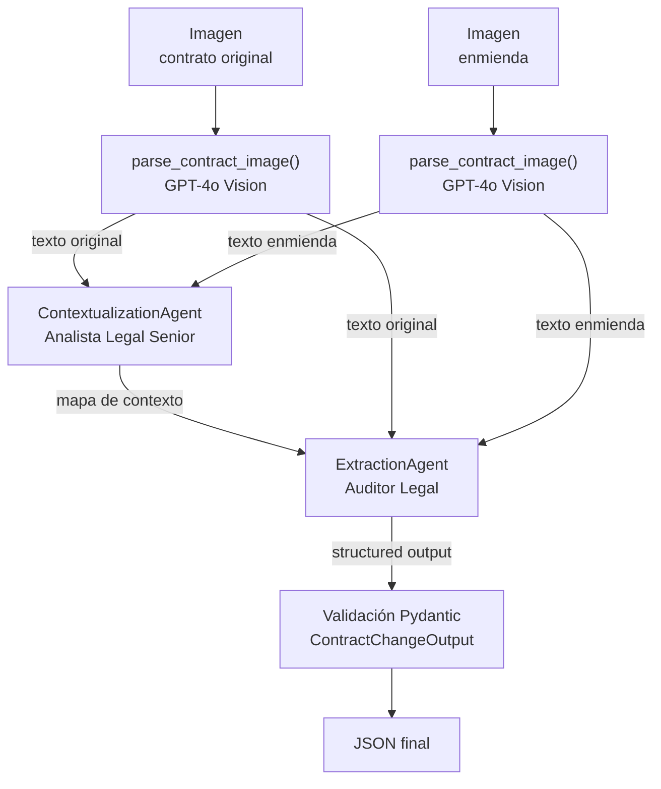

# LegalMove — Agente Autónomo de Comparación de Contratos

Proyecto Integrador del Módulo 4 de AI Engineering (Henry).

Sistema multi-agente que recibe las imágenes escaneadas de un contrato
original y de su enmienda, extrae el texto con GPT-4o Vision y, mediante dos
agentes especializados, identifica y resume los cambios legales. La salida es
un JSON validado con Pydantic y cada etapa queda registrada en Langfuse.

## Problema

El equipo de Compliance de LegalMove dedica más de 40 horas semanales a
comparar manualmente contratos con sus enmiendas. Este sistema automatiza esa
comparación y devuelve un reporte estructurado que otros sistemas pueden
procesar sin intervención humana.

## Arquitectura



El pipeline tiene cuatro etapas:

1. **Parsing multimodal.** `parse_contract_image()` codifica cada imagen en
   base64 y le pide a GPT-4o que transcriba el contrato de forma fiel,
   conservando la numeración de las cláusulas. Se ejecuta dos veces: una por
   documento.
2. **Agente 1: contextualización.** Recibe los dos textos y arma un mapa de
   correspondencia: qué secciones existen en cada documento, cuál se
   corresponde con cuál y cuáles aparecen solo en uno de los dos. No detecta
   cambios.
3. **Agente 2: extracción.** Recibe el mapa del Agente 1 junto con los dos
   textos completos, identifica cada cambio y lo clasifica como adición,
   eliminación o modificación. Devuelve directamente un `ContractChangeOutput`.
4. **Validación.** El resultado se valida de nuevo con Pydantic antes de salir
   del pipeline.

### Por qué dos agentes

Comparar dos contratos implica resolver dos problemas distintos: **alinear**
las secciones (qué cláusula de la enmienda corresponde a cuál del original) y
**comparar el contenido** de cada par ya alineado. Si un solo prompt resuelve
ambos, un error de alineación se convierte directamente en un cambio inventado
o en uno omitido, y no hay forma de saber cuál de las dos tareas falló.

Separarlos da tres ventajas:

- Cada agente tiene un system prompt con un rol y una responsabilidad únicos,
  y se le prohíbe explícitamente hacer el trabajo del otro.
- El mapa del Agente 1 queda registrado en Langfuse, así que ante un resultado
  incorrecto se puede ver si falló la alineación o la comparación.
- El Agente 2 recibe el mapa **y** los textos completos: el mapa le indica
  dónde mirar y los textos le dan la redacción exacta para detectar cambios
  de montos, plazos o palabras.

## Estructura del repositorio

```
legalmove-contract-agent/
├── src/
│   ├── main.py                       # Entry point, orquestación y spans de Langfuse
│   ├── image_parser.py               # Validación, encoding base64 y llamada a GPT-4o Vision
│   ├── models.py                     # ContractChangeOutput (Pydantic)
│   ├── retry.py                      # Reintentos ante errores transitorios de la API
│   └── agents/
│       ├── contextualization_agent.py   # Agente 1
│       └── extraction_agent.py          # Agente 2
├── data/
│   └── test_contracts/               # 3 pares de contratos de prueba + README
├── requirements.txt
├── .env.example
└── README.md
```

## Setup

Requisitos: Python 3.10 o superior (desarrollado con 3.13), una API key de OpenAI con acceso a
GPT-4o y una cuenta en [Langfuse Cloud](https://cloud.langfuse.com).

**1. Clonar el repositorio**

```bash
git clone <url-del-repositorio>
cd legalmove-contract-agent
```

**2. Crear y activar el entorno virtual**

```bash
python -m venv .venv

# Git Bash (Windows)
source .venv/Scripts/activate

# PowerShell (Windows)
.venv\Scripts\Activate.ps1

# macOS / Linux
source .venv/bin/activate
```

**3. Instalar dependencias**

```bash
pip install -r requirements.txt
```

**4. Configurar variables de entorno**

```bash
cp .env.example .env
```

Completar `.env` con las claves reales:

| Variable | Dónde se obtiene |
|---|---|
| `OPENAI_API_KEY` | [platform.openai.com/api-keys](https://platform.openai.com/api-keys) |
| `LANGFUSE_PUBLIC_KEY` | Langfuse → Settings → API Keys |
| `LANGFUSE_SECRET_KEY` | Langfuse → Settings → API Keys |
| `LANGFUSE_HOST` | Depende de la región del proyecto (ver nota) |

> **Nota sobre `LANGFUSE_HOST`:** Langfuse Cloud tiene dos regiones con hosts
> distintos: `https://cloud.langfuse.com` (EU) y `https://us.cloud.langfuse.com`
> (US). Si el host no coincide con la región del proyecto, la exportación de
> trazas falla con `401 Unauthorized` aunque las claves sean correctas.

## Uso

Desde la raíz del proyecto, con el entorno virtual activado:

```bash
python -m src.main <imagen_original> <imagen_enmienda>
```

Ejemplo con el Par 1 de prueba:

```bash
python -m src.main data/test_contracts/par1_original.jpg data/test_contracts/par1_enmienda.jpg
```

Salida:

```json
{
  "sections_changed": [
    "3. Precio",
    "4. Disponibilidad del Servicio",
    "5. Soporte"
  ],
  "topics_touched": [
    "condiciones de pago",
    "nivel de servicio",
    "soporte al cliente"
  ],
  "summary_of_the_change": "La enmienda introduce tres cambios principales: 1) El precio mensual que el Cliente debe pagar se incrementó de USD 1.200 a USD 1.250. 2) El nivel de disponibilidad del servicio garantizado por el Proveedor aumentó de 99,5% a 99,9%. 3) Se amplió el canal de soporte al cliente, que ahora incluye no solo correo electrónico sino también un sistema de tickets en línea."
}
```

Ver [data/test_contracts/README.md](data/test_contracts/README.md) para los
tres pares disponibles y los cambios esperados en cada uno.

## Modelo de salida

```python
class ContractChangeOutput(BaseModel):
    sections_changed: list[str]      # Secciones modificadas, agregadas o eliminadas
    topics_touched: list[str]        # Categorías legales o comerciales afectadas
    summary_of_the_change: str       # Descripción detallada de los cambios
```

Los tres campos son obligatorios y no aceptan valores vacíos (`min_length=1`).
Cada campo tiene una `description` que se envía al modelo como parte del JSON
schema, de modo que funciona también como instrucción de qué completar.

## Trazabilidad con Langfuse

Cada ejecución genera una traza con esta jerarquía:

```
contract-analysis                  (span raíz: paths de entrada y JSON final)
├── parse_original_contract        (generation: path, texto extraído, tokens)
├── parse_amendment_contract       (generation: path, texto extraído, tokens)
├── contextualization_agent        (generation: ambos textos, mapa de contexto)
└── extraction_agent               (generation: mapa de contexto, JSON validado)
```

Para cada etapa quedan registrados el input, el output, la latencia, el consumo
de tokens y el costo. En las etapas de parsing los tokens son los que informa la
API de OpenAI; en los agentes, Langfuse los estima a partir del input y output
registrados en el span. Si la validación Pydantic falla, el span
`extraction_agent` queda marcado con nivel `ERROR` y el detalle del error.

Con esto, ante cualquier resultado se puede reconstruir el camino completo:
qué texto leyó el OCR, qué mapa armó el Agente 1 y con qué información decidió
el Agente 2.

## Manejo de errores

| Situación | Comportamiento |
|---|---|
| Falta `OPENAI_API_KEY` | Falla antes de llamar a la API, con un mensaje que indica configurar `.env` |
| La imagen no existe | Falla antes de llamar a la API: `Error de entrada: No se encontró la imagen` |
| Extensión no soportada | Falla antes de llamar a la API; solo acepta `.jpg`, `.jpeg` y `.png` |
| Rate limit, timeout, error 5xx o de conexión | Reintenta hasta 3 veces con espera creciente (2 s, 4 s) |
| API key inválida o request mal formado | Falla sin reintentar, porque reintentar no cambiaría el resultado |
| El JSON no cumple el schema | Error de validación con el detalle de Pydantic |

En todos los casos el programa termina con código de salida `1` y un mensaje
legible en lugar de un traceback.

## Decisiones técnicas

**GPT-4o Vision en lugar de OCR tradicional.** El objetivo no es solo leer
caracteres, sino conservar la estructura del documento (títulos, numeración de
cláusulas) que los agentes necesitan para alinear secciones. El prompt de
parsing prohíbe resumir o interpretar: esa etapa solo transcribe.

**`detail: "high"` y `temperature=0` en el parsing.** Los contratos son texto
denso, donde un dígito mal leído cambia el sentido de una cláusula. La
resolución alta mejora la lectura y la temperatura cero reduce la variación
entre ejecuciones.

**Cliente de OpenAI para el parsing, LangChain para los agentes.** El parsing
es una única llamada multimodal y no necesita una capa adicional. En los
agentes, LangChain aporta `with_structured_output()`, que convierte el modelo
Pydantic en JSON schema y devuelve el objeto ya parseado.

**Structured outputs más validación explícita.** `with_structured_output()` ya
obliga al modelo a respetar el schema, pero el resultado se valida otra vez con
`ContractChangeOutput.model_validate()` antes de salir del pipeline. La salida
de un modelo se trata como un dato no confiable hasta validarla.

**Prompts con verificación de evidencia.** Durante el desarrollo, una ejecución
del Par 1 reportó una cláusula de "Renovación Automática" que no existe en
ninguno de los dos documentos. El texto del OCR era correcto, así que el error
venía del razonamiento de los agentes. Se agregó a ambos prompts una regla que
exige poder señalar la evidencia textual de cada cambio antes de reportarlo.

**Validación temprana.** Las variables de entorno y los archivos se validan
antes de instanciar los agentes, para que un error de configuración falle
rápido y con un mensaje claro.

**Versiones fijadas en `requirements.txt`.** Garantiza que el proyecto instale
exactamente las mismas versiones en cualquier máquina.

## Limitaciones conocidas

- **No determinismo.** Aun con `temperature=0`, GPT-4o puede devolver
  resultados distintos en dos ejecuciones con la misma entrada. La regla de
  verificación de evidencia reduce las alucinaciones, pero no las elimina.
- **Cambios de redacción sutiles.** En el Par 2, la enmienda quita las palabras
  "intransferible" y "únicamente" de la cláusula de licencia. El OCR las
  transcribe correctamente, pero el Agente 2 reporta el cambio de redacción sin
  mencionar que la licencia deja de ser intransferible.
- **Un solo formato de entrada.** El sistema acepta imágenes JPEG y PNG de una
  página; no procesa PDFs ni documentos de varias páginas.
